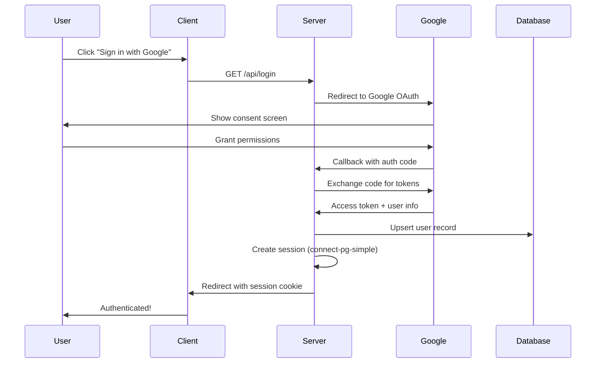
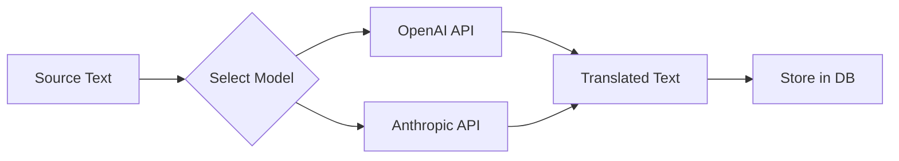

# Babellion - AI-Powered Translation & Proofreading Platform

Babellion is a full-stack TypeScript application that provides AI-powered translation, proofreading, and image editing capabilities. It leverages multiple AI providers (OpenAI, Anthropic, Google Gemini) to deliver high-quality language processing services.

## Features

- **Text Translation** - Translate text to multiple languages simultaneously using AI models
- **Two-Step Proofreading** - AI-assisted proofreading with proposed changes and final refinement
- **Image Translation** - Extract and translate text from images
- **Image Editing** - AI-powered image manipulation with drawing canvas support
- **PDF Import** - Extract text from PDF documents for translation
- **Google Docs Integration** - Import/export documents directly from Google Docs
- **Multi-Model Support** - Choose from OpenAI, Anthropic, or Google Gemini models
- **User Feedback System** - Collect and analyze translation feedback

---

## Architecture

```
┌─────────────────────────────────────────────────────────────────────┐
│                           Client (React)                             │
│  ┌─────────────┐ ┌─────────────┐ ┌─────────────┐ ┌───────────────┐  │
│  │  Translate  │ │  Proofread  │ │ Image Trans │ │  Image Edit   │  │
│  └─────────────┘ └─────────────┘ └─────────────┘ └───────────────┘  │
│                         TanStack Query + Wouter                      │
└────────────────────────────────┬────────────────────────────────────┘
                                 │ HTTP/REST
┌────────────────────────────────┴────────────────────────────────────┐
│                         Server (Express.js)                          │
│  ┌──────────────────────────────────────────────────────────────┐   │
│  │                        routes.ts                              │   │
│  │  /api/auth/* │ /api/translations/* │ /api/proofreading/*     │   │
│  │  /api/image-translations/* │ /api/image-edits/*              │   │
│  └──────────────────────────────────────────────────────────────┘   │
│                                 │                                    │
│  ┌──────────────┐  ┌────────────────────┐  ┌────────────────────┐   │
│  │ replitAuth   │  │ translationService │  │ proofreadingService│   │
│  │ (Google OAuth)│  │  (OpenAI/Claude)   │  │   (AI Rules)       │   │
│  └──────────────┘  └────────────────────┘  └────────────────────┘   │
│                                 │                                    │
│  ┌──────────────┐  ┌────────────────────┐  ┌────────────────────┐   │
│  │  encryption  │  │ imageEditService   │  │ imageTranslation   │   │
│  │  (AES-256)   │  │  (Gemini Vision)   │  │    Service         │   │
│  └──────────────┘  └────────────────────┘  └────────────────────┘   │
│                                 │                                    │
│  ┌──────────────────────────────────────────────────────────────┐   │
│  │                    storage.ts (Drizzle ORM)                   │   │
│  └──────────────────────────────────────────────────────────────┘   │
└────────────────────────────────┬────────────────────────────────────┘
                                 │
┌────────────────────────────────┴────────────────────────────────────┐
│                     PostgreSQL (Neon Serverless)                     │
│  users │ translations │ proofreading │ image_* │ api_keys │ ...    │
└─────────────────────────────────────────────────────────────────────┘
```

### Directory Structure

```
babellion/
├── client/                    # React frontend (Vite)
│   ├── src/
│   │   ├── components/        # Reusable UI components
│   │   │   └── ui/            # shadcn/ui components
│   │   ├── hooks/             # Custom React hooks
│   │   ├── lib/               # Utilities (queryClient, auth)
│   │   └── pages/             # Route pages
│   └── public/                # Static assets
│
├── server/                    # Express.js backend
│   ├── routes.ts              # API route definitions
│   ├── storage.ts             # Database access layer (Drizzle)
│   ├── translationService.ts  # OpenAI/Anthropic translation
│   ├── proofreadingService.ts # AI proofreading logic
│   ├── imageEditService.ts    # Gemini image editing
│   ├── imageTranslationService.ts
│   ├── pdfService.ts          # PDF text extraction
│   ├── googleDocsService.ts   # Google Docs API integration
│   ├── replitAuth.ts          # Google OAuth + session management
│   ├── encryption.ts          # AES-256-CBC for API keys
│   ├── retry.ts               # Database retry with backoff
│   └── __tests__/             # Server unit tests
│
├── shared/                    # Shared code between client/server
│   ├── schema.ts              # Drizzle ORM schemas + Zod validation
│   └── __tests__/             # Schema validation tests
│
├── test/                      # Test utilities
│   ├── setup.ts               # Vitest global setup
│   ├── mocks/                 # Mock factories
│   └── utils/                 # Test helpers
│
└── migrations/                # Database migrations
```

---

## Authentication

### Google OAuth 2.0 Flow

The application uses **Passport.js** with the **Google OAuth 2.0** strategy for authentication.



### Session Management

- Sessions stored in PostgreSQL using `connect-pg-simple`
- Session cookie: `babellion.sid`
- Google tokens stored encrypted in user record for Docs API access

### Authorization Middleware

```typescript
// server/replitAuth.ts

isAuthenticated   // Verifies user is logged in (401 if not)
isAdmin           // Verifies user has admin role (403 if not)
```

### Access Control Rules

| Resource | Read | Edit | Delete |
|----------|------|------|--------|
| Own private content | ✅ Owner | ✅ Owner | ✅ Owner |
| Own public content | ✅ Owner | ✅ Owner | ✅ Owner |
| Others' public content | ✅ Anyone | ❌ | ❌ |
| Others' private content | ❌ | ❌ | ❌ |
| Admin on public content | ✅ | ✅ | ✅ |
| Admin on private content | ❌ | ❌ | ❌ |

---

## AI Integration

### Supported Providers

| Provider | Models | Use Cases |
|----------|--------|-----------|
| **OpenAI** | GPT-4o, GPT-4-turbo, o1, o3 | Translation, Proofreading |
| **Anthropic** | Claude 3.5 Sonnet, Claude 3 Opus | Translation, Proofreading |
| **Google Gemini** | Gemini 2.0 Flash, Gemini Pro Vision | Image Translation, Image Editing |

### Translation Flow



### Two-Step Proofreading

1. **Step 1: Analysis** - AI identifies issues and proposes changes as JSON
2. **Step 2: Application** - AI applies accepted changes to produce final text

```typescript
// ProofreadingService response structure
interface ProofreadingResult {
  rule: string;           // Which rule was applied
  original_text: string;  // The problematic text
  suggested_change: string; // The fix
  rationale: string;      // Explanation
}
```

### API Key Security

API keys for AI providers are encrypted at rest using **AES-256-CBC**:

```typescript
// server/encryption.ts
encrypt(apiKey)  // Store encrypted in database
decrypt(stored)  // Decrypt when making API calls
```

Environment variable required: `ENCRYPTION_KEY` (32+ characters)

---

## Database Schema

### Core Tables

| Table | Purpose |
|-------|---------|
| `users` | User accounts (Google OAuth) |
| `sessions` | Express session storage |
| `translations` | Translation projects |
| `translation_outputs` | Per-language translation results |
| `proofreadings` | Proofreading projects |
| `proofreading_outputs` | Proofreading results |
| `proofreading_rule_categories` | Rule groupings |
| `proofreading_rules` | Individual proofreading rules |
| `image_translations` | Image translation projects |
| `image_translation_outputs` | Image translation results |
| `image_edits` | Image editing projects |
| `image_edit_outputs` | Image editing results |
| `ai_models` | Available AI models configuration |
| `languages` | Supported target languages |
| `api_keys` | Encrypted provider API keys |
| `settings` | System configuration (prompts, etc.) |
| `translation_feedback` | User feedback on translations |

### Key Relationships

```
users ─┬─< translations ───< translation_outputs
       ├─< proofreadings ──< proofreading_outputs
       ├─< image_translations ──< image_translation_outputs
       └─< image_edits ────< image_edit_outputs

proofreading_rule_categories ─< proofreading_rules
```

---

## Testing

### Test Framework

- **Vitest** - Fast unit test runner with native TypeScript support
- **Coverage** - V8 coverage provider

### Running Tests

```bash
# Run all tests
pnpm test

# Run tests once (CI mode)
pnpm test:run

# Run with coverage report
pnpm test:coverage

# Watch mode
pnpm test:watch
```

### Test Structure

```
test/
├── setup.ts                    # Global test setup, env mocks
├── mocks/
│   └── storage.mock.ts         # Storage layer mock factories
└── utils/
    └── request.mock.ts         # Express req/res mock helpers

server/__tests__/
├── encryption.test.ts          # Encryption roundtrip tests
├── retry.test.ts               # Database retry logic tests
├── translationService.test.ts  # JSON extraction, model detection
├── proofreadingService.test.ts # Result parsing tests
├── auth.middleware.test.ts     # isAuthenticated/isAdmin tests
├── routes.authorization.test.ts # Access control pattern tests
├── storage.test.ts             # Storage layer CRUD tests
├── routes.integration.test.ts  # API endpoint integration tests
└── aiServices.mock.test.ts     # AI service logic tests

shared/__tests__/
└── schema.test.ts              # Zod validation schema tests
```

### Test Summary

**Total: 185 tests across 10 test files**

| Test File | Tests | Description |
|-----------|-------|-------------|
| `encryption.test.ts` | 10 | Encrypt/decrypt roundtrip, edge cases |
| `retry.test.ts` | 13 | Retry logic, error code detection |
| `translationService.test.ts` | 18 | JSON extraction, model detection |
| `proofreadingService.test.ts` | 14 | Result parsing from AI responses |
| `auth.middleware.test.ts` | 7 | Auth middleware behavior |
| `routes.authorization.test.ts` | 25 | Access control patterns |
| `storage.test.ts` | 24 | Storage layer CRUD operations |
| `routes.integration.test.ts` | 22 | API endpoint integration |
| `aiServices.mock.test.ts` | 25 | AI service logic patterns |
| `schema.test.ts` | 27 | Zod validation rules |

### Test Categories

#### 1. Security Tests (`encryption.test.ts`)
- Roundtrip encryption/decryption
- Unicode and special character handling
- Different ciphertext for same input (random IV)

#### 2. Resilience Tests (`retry.test.ts`)
- Transient database error detection (57P01, 57P02, 57P03)
- Connection error handling (ECONNREFUSED, ECONNRESET)
- Exponential backoff behavior
- Non-retryable error passthrough

#### 3. Auth Middleware Tests (`auth.middleware.test.ts`)
- `isAuthenticated` - 401 for unauthenticated requests
- `isAdmin` - 403 for non-admin users
- Database lookup for admin verification

#### 4. Authorization Tests (`routes.authorization.test.ts`)
- Owner access to private content
- Public content visibility
- Admin privileges on public content
- Admin restrictions on private content
- Self-role change prevention

#### 5. Storage Layer Tests (`storage.test.ts`)
- User CRUD operations
- Translation and output operations
- AI Model and Language operations
- API Key and Settings storage
- Proofreading and Image operations
- Pagination behavior

#### 6. API Integration Tests (`routes.integration.test.ts`)
- Authentication endpoints (401/403 handling)
- Translation CRUD with access control
- Admin route protection
- Request validation and error handling

#### 7. AI Service Tests (`aiServices.mock.test.ts`)
- Model detection (reasoning vs. standard)
- JSON extraction from various response formats
- Proofreading result parsing
- Error handling patterns

#### 8. Schema Validation Tests (`schema.test.ts`)
- Required field enforcement
- Optional field handling
- Type validation
- Error message quality

---

## Development

### Prerequisites

- Node.js 20+
- pnpm
- PostgreSQL (or Neon serverless)

### Environment Variables

```env
DATABASE_URL=postgresql://...
ENCRYPTION_KEY=your-32-char-encryption-key
SESSION_SECRET=your-session-secret
GOOGLE_CLIENT_ID=your-google-oauth-client-id
GOOGLE_CLIENT_SECRET=your-google-oauth-client-secret
```

### Getting Started

```bash
# Install dependencies
pnpm install

# Push database schema
pnpm db:push

# Start development server
pnpm dev

# Build for production
pnpm build

# Start production server
pnpm start
```

### Scripts

| Command | Description |
|---------|-------------|
| `pnpm dev` | Start dev server with hot reload |
| `pnpm build` | Build for production |
| `pnpm start` | Run production build |
| `pnpm check` | TypeScript type checking |
| `pnpm db:push` | Push schema to database |
| `pnpm test` | Run tests in watch mode |
| `pnpm test:run` | Run tests once |
| `pnpm test:coverage` | Run tests with coverage |

---

## Tech Stack

### Frontend
- **React 18** - UI library
- **Vite** - Build tool
- **TanStack Query** - Server state management
- **Wouter** - Lightweight routing
- **Radix UI** - Accessible component primitives
- **shadcn/ui** - Component library
- **Tailwind CSS** - Utility-first styling
- **TipTap** - Rich text editor
- **Konva/React-Konva** - Canvas drawing

### Backend
- **Express.js** - Web framework
- **Drizzle ORM** - Type-safe database access
- **Passport.js** - Authentication
- **Zod** - Runtime validation
- **OpenAI SDK** - GPT integration
- **Anthropic SDK** - Claude integration
- **Google GenAI** - Gemini integration

### Database
- **PostgreSQL** - Primary database
- **Neon** - Serverless PostgreSQL
- **connect-pg-simple** - Session storage

### Testing
- **Vitest** - Test runner
- **@vitest/coverage-v8** - Coverage reporting

---

## License

MIT

